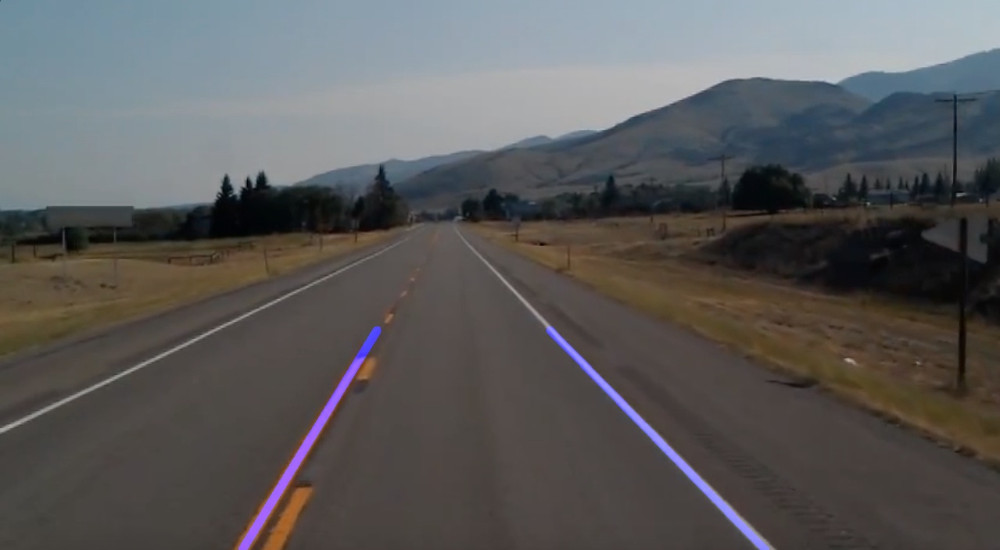
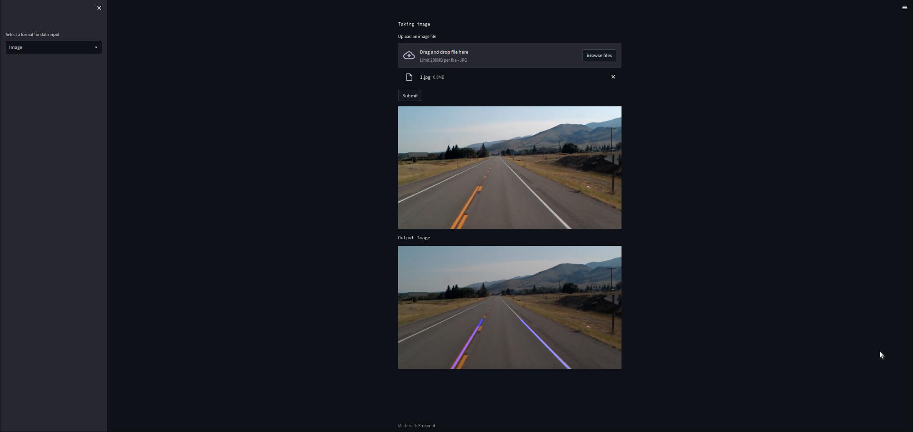

# lane-detection-daisi

## Description 
This lane detection daisi detects lane from an image/video and returns an image with the lanes highlighted.

### Screenshots

  

## To run the daisi on your localhost 
1. Install `pip` and `python>=3.8`
2. Download this repository and create a virtual environment `myenv`
3. Activate the virtual environment and type `pip install requirements.txt` in the terminal. This will get all the dependencies installed on your local PC.
4. In the terminal type `streamlit run main.py` and wait for the browser to open the app on your localhost
5. Now you can use the app there !

## Testing the API 

1. Python  
-----------
import pydaisi as pyd
 
lane_detection = pyd.Daisi("atharva0300/Lane Detection")

